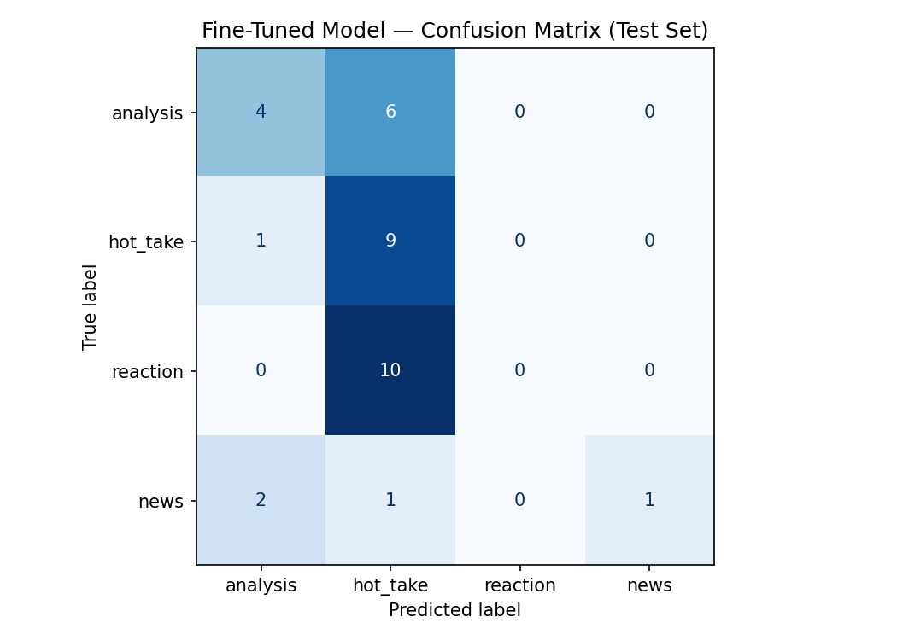

# TakeMeter — r/nba Discourse Quality Classifier

A fine-tuned DistilBERT text classifier that sorts r/nba comments into four
discourse types: **analysis**, **hot_take**, **reaction**, and **news** — compared
against a zero-shot Groq baseline.

---

## What I Built

TakeMeter classifies r/nba comments by *the kind of contribution they make* to
community discussion, not by topic. The goal was to capture the distinction
r/nba regulars make constantly — between a stat-backed argument, a confident
opinion with no support, a raw emotional reaction, and a reposted news item.

- **Base model:** `distilbert-base-uncased`
- **Baseline:** zero-shot `llama-3.3-70b-versatile` via Groq
- **Dataset:** 222 labeled posts/comments, stratified 70/15/15 split
- **Headline result:** the zero-shot baseline (70.6%) **outperformed** the
  fine-tuned model (41.2%). This is a real, instructive outcome — analyzed below.

## Labels

| Label | Definition |
|-------|------------|
| `analysis` | Structured argument backed by specific, verifiable evidence (stats, cap/roster details, historical or tactical reasoning). Reasoning stands without the opinion. |
| `hot_take` | Bold, confident opinion asserted without real evidence, or with vague/cherry-picked evidence used decoratively. Asserts rather than argues. |
| `reaction` | Immediate emotional response, joke, or expression of feeling. Little to no argument. |
| `news` | Factual report of an event, transaction, or quote, with no opinion from the commenter. |

Full definitions, examples, and edge-case rules are in [`planning.md`](./planning.md).

## Data

- **Sources:** public r/nba posts and comments via the Arctic Shift API.
  Posts supplied most `news` examples (reporter tweets); comments supplied most
  `reaction` / `hot_take` / `analysis` examples.
- **Collection:** `scraper_comments.py` (comments) plus an earlier post pull,
  cleaned with `clean.py`.
- **Labeling:** I pre-labeled scraped comments with Groq (`prelabel.py`), then
  reviewed and corrected **every** row myself using `label_tool.py` and a
  spreadsheet pass (see AI Usage). Final data merged + shuffled via `merge.py`.
- **Final label distribution (222 total):**

| Label | Count | % |
|-------|------:|---:|
| analysis | 67 | 30.2% |
| hot_take | 66 | 29.7% |
| reaction | 62 | 27.9% |
| news | 27 | 12.2% |
| **Total** | **222** | 100% |

No class exceeds 70%; `news` is the thinnest (12%) because comments rarely relay
news the way posts do.

### Three genuinely hard cases

These are real boundary calls I made during annotation (recorded in the dataset
`notes` column):

1. **"I don't get your point. Murray was clearly hurt last year in the playoffs…"**
   — **reaction vs. hot_take.** A lengthy opinionated reply, but it's an in-thread
   emotional rebuttal with no structured evidence. Decided **reaction** because the
   energy is "responding to someone," not "making an argument."
2. **"Hot take. I would like [Ament] here for OKC, if they can find a way to give
   him minutes…"** — **hot_take vs. analysis.** It literally says "hot take" but
   then gives team-fit reasoning. Decided **analysis** because the reasoning is
   real; the self-label is just framing.
3. **"Yeah they're gonna give him the keys. Lavine and DeMar will be gone…"**
   — **hot_take vs. reaction.** A confident future prediction. Decided **hot_take**
   because it asserts a claim about what *will* happen rather than just reacting.

## Fine-Tuning

- **Started from:** `distilbert-base-uncased` (pretrained, uncased).
- **Approach:** sequence-classification fine-tuning, 3 epochs on the 155-example
  train split, validated on 33 held-out examples.
- **Key hyperparameter decision:** I kept the notebook defaults (learning rate
  `2e-5`, 3 epochs, batch size 16). With only ~155 training examples, raising the
  epoch count risks overfitting, and `2e-5` is the standard stable starting point
  for BERT-family fine-tuning. Given the small-data regime, the right call was to
  *not* push the model harder — and the results below show even these conservative
  settings couldn't extract a strong signal from this little data.

## Evaluation

### Overall accuracy

| Model | Accuracy |
|-------|---------:|
| Zero-shot baseline (llama-3.3-70b) | **0.706** |
| Fine-tuned DistilBERT | **0.412** |

Fine-tuning **regressed** by 0.294 versus the baseline.

### Per-class metrics — fine-tuned

| Label | Precision | Recall | F1 |
|-------|----------:|-------:|---:|
| analysis | 0.57 | 0.40 | 0.47 |
| hot_take | 0.35 | 0.90 | 0.50 |
| reaction | 0.00 | 0.00 | 0.00 |
| news | 1.00 | 0.25 | 0.40 |
| **macro avg** | 0.48 | 0.39 | 0.34 |

### Per-class metrics — baseline (Groq)

| Label | Precision | Recall | F1 |
|-------|----------:|-------:|---:|
| analysis | 0.89 | 0.80 | 0.84 |
| hot_take | 1.00 | 0.40 | 0.57 |
| reaction | 0.50 | 0.80 | 0.62 |
| news | 0.80 | 1.00 | 0.89 |
| **macro avg** | 0.80 | 0.75 | 0.73 |

### Confusion matrix — fine-tuned (test set, n=34)

Rows = true label, columns = predicted. Diagonal (bold) = correct predictions.
The table below is the same data in text form.

| true \ pred | analysis | hot_take | reaction | news |
|-------------|---------:|---------:|---------:|-----:|
| **analysis** (10) | **4** | 6 | 0 | 0 |
| **hot_take** (10) | 1 | **9** | 0 | 0 |
| **reaction** (10) | 0 | 10 | **0** | 0 |
| **news** (4) | 2 | 1 | 0 | **1** |

The single most telling fact: the model predicted `hot_take` for **26 of 34**
test examples, and predicted `reaction` **zero** times for **anything**. The
entire `reaction` column is empty. All 10 true reactions were funneled into
`hot_take`, and 6 of 10 analyses went there too. The model didn't learn four
categories — it effectively learned "hot_take, or one of three exceptions."

### Three errors, analyzed

1. **True: reaction → Predicted: hot_take** — *"Really? It's a weird pick for me,
   but who knows maybe they got trades ready."* This is someone reacting in a
   thread, but the model sees opinion words ("weird pick") and defaults to
   hot_take. The model never learned reaction at all (F1 = 0.00), so every
   reaction had to land somewhere else — and short opinionated comments look
   identical to weak hot_takes to a small model.
2. **True: news → Predicted: analysis** — *"[Krawczynski] So far this offseason the
   Timberwolves have held discussions on Giannis, Kyrie, Trey Murphy…"* The model
   learned that the `[Reporter]` bracket signals "not-reaction," but a long factual
   list of names reads like reasoning to it, so it tips into analysis. It captured
   a surface cue (brackets) without the concept (neutral reporting).
3. **True: analysis → Predicted: hot_take** — *"There are plenty of players who
   rely on athleticism too much and never transition… people have said this about
   [Giannis] for years."* This is a real argument, but it has no numbers or
   bracketed source, so the model — which leaned on stats/brackets as its only
   evidence signals — couldn't tell structured reasoning from a confident opinion.

**Dominant pattern:** the model collapses toward **`hot_take`** (recall 0.90 — it
over-predicts it) and **cannot identify `reaction` at all** (F1 0.00). The
reaction→hot_take and analysis→hot_take boundaries account for most errors.
Confidence scores on wrong predictions sit at ~0.29–0.31 — barely above a 4-way
random guess (0.25), confirming the model is broadly *uncertain*, not confidently
wrong. This is a data-quantity problem, not an annotation problem: 43 reaction
training examples is too few for a small model to separate short emotional
comments from short opinionated ones.

### Sample classifications

| Comment | Predicted | Confidence |
|---------|-----------|-----------:|
| "[Siegel] The Heat want a decision on their Giannis pursuit before Monday night…" | hot_take | 0.28 |
| "There are plenty of players who rely on athleticism too much…" | hot_take | 0.31 |
| "[Krawczynski] The Timberwolves have held discussions on Giannis, Kyrie…" | analysis | 0.27 |

A correct prediction explained: a `hot_take` such as *"Loyalty from a player is
the most overrated thing in sports"* is predicted **hot_take** correctly — but
this is partly luck. Because the model defaults to `hot_take` for 26 of 34 inputs,
it gets most true hot_takes right (recall 0.90) almost by accident; its precision
on that class is only 0.35, meaning it's right about *being* a hot_take far less
often than it claims one.

## Reflection: Intended vs. Learned

I intended the model to learn **discourse quality** — to tell a reasoned argument
from a bare assertion from an emotional reaction. What it actually learned was much
shallower:

- It learned that **`[Reporter]` brackets ≈ not-opinion**, which is why `news`
  precision was perfect (1.00) — but that's a formatting cue, not an understanding
  of neutral reporting (it still misrouted bracket-less news into analysis).
- It learned that **anything opinion-flavored ≈ hot_take**, collapsing reaction and
  much of analysis into that one bucket.
- It **never learned `reaction`** as a distinct category at all.

The gap is stark: the 70B baseline already *understands* these concepts and scored
0.71 zero-shot, while DistilBERT, given 155 examples, only managed to memorize a
couple of surface correlations. The lesson is that for a subjective, concept-heavy
task like this, a few hundred examples is enough to demonstrate the boundaries are
real but **not** enough to teach a small model to internalize them — the
distinctions live in meaning, and DistilBERT latched onto form instead.

## Spec Reflection

- **One way the spec helped:** forcing me to write precise label definitions and a
  decision rule *before* annotating caught that "good take vs. bad take" was too
  vague. The four concrete labels are what made consistent annotation — and a
  measurable model — possible at all.
- **One way I diverged and why:** the project's example taxonomy was three labels
  (analysis/hot_take/reaction). I added a fourth, **`news`**, because raw r/nba is
  dominated by reporter tweets that fit none of the original three. This made the
  data realistic but also created the thinnest class (12%), which contributed to
  the small-data struggles — a tradeoff I'd make again for fidelity to the
  community.

## AI Usage

1. **Pre-labeling (annotation assist).** I used Groq `llama-3.3-70b-versatile` via
   `prelabel.py` to suggest an initial label for every scraped comment, then
   reviewed and corrected each one myself (`label_tool.py` + a spreadsheet pass).
   The model heavily over-assigned `reaction`; on review I moved many of those to
   `hot_take` where the comment was actually asserting an opinion. Every final
   label is my own decision.
2. **Failure-pattern surfacing.** After training, I reviewed the misclassified
   test examples and used an LLM to help name the dominant pattern (reaction and
   analysis both collapsing into hot_take). I verified each claimed pattern against
   the actual Cell 17 output and the per-class recall numbers before writing the
   error analysis — e.g. confirming reaction F1 was truly 0.00 rather than just low.

## Repo Contents

- `planning.md` — design doc (labels, edge cases, metrics, success criteria)
- `nba_takemeter_dataset.csv` — final labeled dataset (222 rows)
- `scraper_comments.py`, `prelabel.py`, `label_tool.py`, `merge.py`, `clean.py` — pipeline
- `evaluation_results.json`, `confusion_matrix.png` — notebook outputs
- `ai201_project3_takemeter_starter_clean.ipynb` — the run notebook
- `README.md` — this file

## How to Reproduce

1. Open the notebook in Colab; set runtime to **T4 GPU**.
2. Cell 4: set the 4-label map. Cell 5: upload `nba_takemeter_dataset.csv`.
3. Run Cells 6–17 (load, split, tokenize, fine-tune, evaluate).
4. Cell 19: add Groq key via Colab Secrets. Cell 20: paste the classification
   prompt. Run Cells 21–22 (baseline).
5. Run Cells 24–25 (comparison + `evaluation_results.json`); download outputs.
